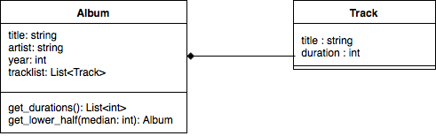

# Introduction
This console program reads list albums and track information from "Albums.txt" to find the median track duration of all the tracks. Then it prints global lower half from within each album in the required format. 
* <N>. Artist - Album - Year - Song - Song Length

# Used Languages and Dependencies
This program uses the following language features
* Python 3.6+ (Interpolated Strings)
* Functools to use Python Reduce method.
* Python Lambda Functions

# Class Diagram
There are two classes used to construct the data structure. They are:
* Album
* Track

## Relationship
Album and Track has a composition relationship between them with Album being the parent relation as shown in the UML Diagram below.

